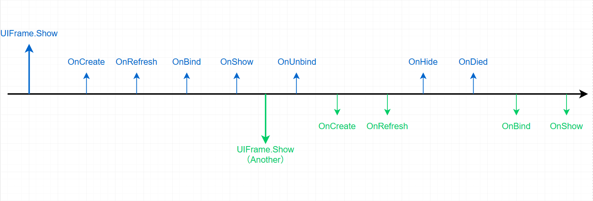

# Godot UIFrame（C#）

一个面向 Godot 4 .NET 的轻量 UI 框架，提供界面栈、分层、生命周期、数据传递、
加载卡顿提示和编辑器自动绑定。

## 安装到其他项目

1. 确保目标项目使用 Godot .NET，且 Godot/.NET 版本与插件兼容。
2. 将本项目的 `addons/ui_frame` 整个复制到目标项目的 `addons/ui_frame`。
3. 等待 C# 编译完成，在 **项目 > 项目设置 > 插件** 中启用 **UIFrame**。
4. 插件会自动注册名为 `UiFrame` 的自动加载节点。

也可以在仓库根目录运行：

```powershell
powershell -ExecutionPolicy Bypass -File ./tools/package_addon.ps1
```

脚本会生成 `dist/ui_frame.zip`。解压到目标项目根目录后启用插件即可。

> 发布包只需要 `addons/ui_frame`。`examples`、`scenes`、`ui` 和 `docs`
> 都是演示工程内容，不应复制到业务项目。

## 项目约定

- C# 类型和对应脚本使用 `PascalCase`，例如 `SettingsPanel.cs`。
- Godot 目录和场景资源使用 `snake_case`，例如
  `res://ui/panels/settings_panel.tscn`。
- UI 场景根节点必须是 `Control`，脚本继承 `UIBase` 或 `UINode<TData>`。
- 顶层界面使用 `UILayer` 子类特性标注，如 `[PanelLayer]`、`[WindowLayer]`。
- 默认场景路径为
  `res://ui/{layer_name_snake_case}/{type_name_snake_case}.tscn`。

例如 `SettingsPanel` 标注 `[PanelLayer]` 后，默认路径是：

```text
res://ui/panels/settings_panel.tscn
```

若你的项目希望使用其他根目录，可在首次显示 UI 前设置：

```csharp
UIFrame.SceneRoot = "res://features/ui";
```

也可以订阅 `UIFrame.LoadNodeFunc` 接入自己的资源系统。

## 基本用法

```csharp
await UIFrame.Show<SettingsPanel>();
await UIFrame.Show<SettingsPanel>(new SettingsPanelData());
await UIFrame.Refresh<SettingsPanel>();
await UIFrame.Hide<SettingsPanel>();
```

子 UI 可直接传实例：

```csharp
await UIFrame.Show(childUi);
await UIFrame.Hide(childUi);
```

## 生命周期

框架生命周期依次为 `OnCreate`、`OnRefresh`、`OnBind`、`OnShow`；关闭时依次调用
`OnUnbind`、`OnHide`，销毁前调用 `OnDied`。



## 编辑器自动绑定

选中挂载了 `UIBase` 派生脚本的节点后，Inspector 会显示
**Auto Bind '-' Nodes**。以 `-` 开头的子节点会按名称匹配 `[Export]`
字段，匹配时忽略大小写、下划线以及私有字段开头的 `_`。

示例见 `examples/basic/TestPanel.cs` 与 `ui/panels/test_panel.tscn`。
